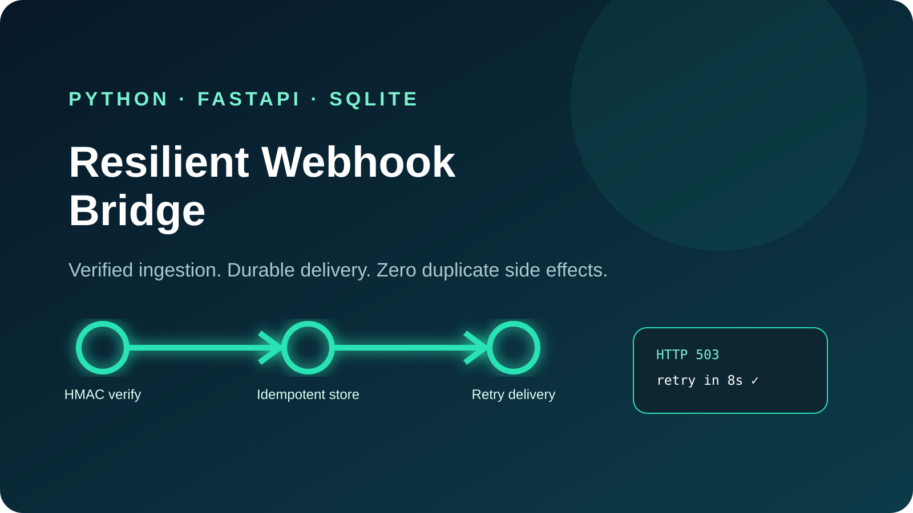

# Resilient Webhook Bridge

[](https://github.com/hexedb/resilient-webhook-bridge/actions)
[](https://www.python.org/)
[](https://fastapi.tiangolo.com/)



A production-style webhook gateway that accepts signed events, stores them exactly once, and reliably forwards them to a downstream API. It demonstrates the failure modes that real CRM, payment and customer-service integrations must handle: duplicate webhooks, replay attempts, temporary outages, rate limits and poison events.

## Why this project matters

Naive integrations perform a downstream API call inside the webhook request. If that call times out, the source retries and duplicate contacts, deals or payments can be created. This project separates **acceptance** from **delivery**:

```text
Source → HMAC verification → idempotent SQLite inbox → retry worker → destination API
```

## Highlights

- HMAC-SHA256 verification with replay-window validation
- Exactly-once event registration using `(source, external_id)` uniqueness
- Durable SQLite inbox/outbox with WAL mode
- Exponential retry scheduling and dead-letter handling
- Stable downstream `Idempotency-Key` headers
- FastAPI health and ingestion endpoints
- Dependency-free delivery transport using the Python standard library
- Docker Compose demo and automated tests

## Quick start

```bash
python -m venv .venv
source .venv/bin/activate  # Windows: .venv\Scripts\activate
pip install -e ".[dev]"
cp .env.example .env
uvicorn webhook_bridge.api:app --reload
```

Open `http://localhost:8000/docs` for the interactive API documentation.

### Send a signed event

```python
import json, time, urllib.request
from webhook_bridge.security import sign_payload

body = json.dumps({"email": "ada@example.com", "status": "qualified"}).encode()
timestamp = int(time.time())
request = urllib.request.Request(
    "http://localhost:8000/webhooks/crm",
    data=body,
    method="POST",
    headers={
        "Content-Type": "application/json",
        "X-Event-Id": "evt-1001",
        "X-Webhook-Timestamp": str(timestamp),
        "X-Webhook-Signature": sign_payload("development-secret-change-me", body, timestamp),
    },
)
print(urllib.request.urlopen(request).read().decode())
```

Sending the same `X-Event-Id` twice returns `"duplicate": true` and does not create another delivery.

## API

| Method | Path | Purpose |
|---|---|---|
| `GET` | `/health` | Service and queue statistics |
| `POST` | `/webhooks/{source}` | Verify and persist an event |

Required headers: `X-Event-Id`, `X-Webhook-Timestamp`, `X-Webhook-Signature`.

## Retry policy

- `2xx`: delivered
- `429` and `5xx`: exponential retry
- other `4xx`: dead-letter immediately
- network exception: exponential retry
- maximum attempts: configurable with `MAX_DELIVERY_ATTEMPTS`

## Test

```bash
pytest -q
```

The suite covers signature validation, replay rejection, event deduplication, stable idempotency keys, retry timing and terminal errors.

## Production extensions

For higher throughput, the `EventStore` can be replaced with PostgreSQL and the in-process worker with Celery, Dramatiq or a cloud queue. The domain and delivery policy remain unchanged.

## Security

No credentials are committed. Use a secret manager in production, enforce HTTPS, rotate signing secrets, apply source-specific secrets and restrict downstream egress.

## License

MIT
